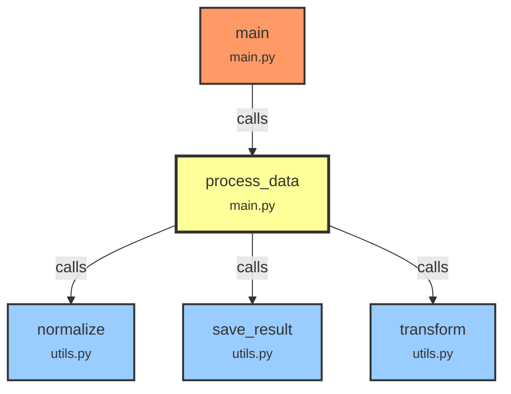
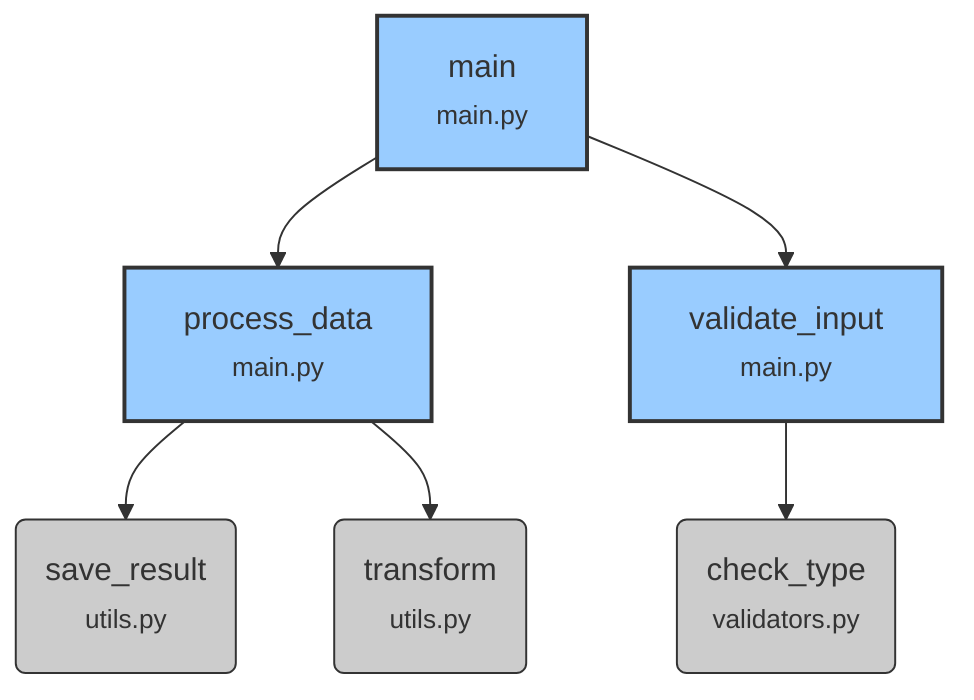

# Implementation Summary: Impact Analysis & Visualization

## Overview
Successfully implemented two core modules for the Code Explorer project:
1. `src/code_explorer/impact.py` - Impact analysis engine
2. `src/code_explorer/visualizer.py` - Mermaid diagram generator

Plus a supporting module:
3. `src/code_explorer/graph.py` - In-memory dependency graph (for testing)

## Implemented Components

### 1. Impact Analysis Module (`impact.py`)

**Location:** `/home/thomas/Developpments/playground/code-explorer/src/code_explorer/impact.py`

**Key Classes:**
- `ImpactResult`: Dataclass representing a single impact result
  - Fields: `function_name`, `file_path`, `line_number`, `impact_type`, `depth`

- `ImpactAnalyzer`: Main analysis engine
  - `analyze_function_impact()`: Find upstream/downstream dependencies
  - `analyze_variable_impact()`: Find where variables are used
  - `format_as_table()`: Format results as Rich table for CLI

**Features:**
- **Upstream analysis**: Find all functions that call a target function (callers)
  - These will break if you change the target function's signature
- **Downstream analysis**: Find all functions called by a target function (callees)
  - These might break your function if they change
- **Bidirectional analysis**: Both upstream and downstream in one query
- **Depth-limited traversal**: Configurable max depth (default: 5 hops)
- **Breadth-first search**: Ensures shortest path is found first
- **Sorted results**: By depth, then file path, then function name

**Example Usage:**
```python
from src.code_explorer.graph import DependencyGraph
from src.code_explorer.impact import ImpactAnalyzer

graph = DependencyGraph()
# ... populate graph ...

analyzer = ImpactAnalyzer(graph)

# Find who calls this function
upstream = analyzer.analyze_function_impact(
    file="main.py",
    function="process_data",
    direction="upstream",
    max_depth=3
)

# Display as table
table = analyzer.format_as_table(upstream)
```

### 2. Visualization Module (`visualizer.py`)

**Location:** `/home/thomas/Developpments/playground/code-explorer/src/code_explorer/visualizer.py`

**Key Classes:**
- `MermaidVisualizer`: Generates Mermaid diagrams from dependency graphs

**Methods:**
- `generate_function_graph()`: Create diagram focused on one function
  - Shows callers (upstream) and callees (downstream)
  - Configurable depth limit
  - Color-coded highlighting (focus, callers, callees)

- `generate_module_graph()`: Create diagram for entire module/file
  - Shows all functions in file
  - Optional: include external imports
  - Different shapes for internal vs external functions

- `save_to_file()`: Save Mermaid code to markdown file

**Mermaid Features:**
- **Node styling**: Different colors for different node types
  - Focus node: Yellow (`#ff9`)
  - Callers (upstream): Red (`#f96`)
  - Callees (downstream): Blue (`#9cf`)
  - Internal functions: Blue (`#9cf`)
  - External functions: Gray (`#ccc`)

- **Node labels**: Include function name and filename
- **Edge labels**: Show relationship type ("calls")
- **Clean IDs**: Sanitized for Mermaid compatibility

**Example Usage:**
```python
from src.code_explorer.visualizer import MermaidVisualizer
from pathlib import Path

visualizer = MermaidVisualizer(graph)

# Generate function-focused diagram
mermaid = visualizer.generate_function_graph(
    focus_function="process_data",
    file="main.py",
    max_depth=2,
    highlight_impact=True
)

# Save to file
visualizer.save_to_file(mermaid, Path("diagram.md"))
```

### 3. Dependency Graph Module (`graph.py`)

**Location:** `/home/thomas/Developpments/playground/code-explorer/src/code_explorer/graph.py`

**Purpose:** In-memory graph for testing (production will use KuzuDB)

**Key Classes:**
- `FunctionNode`: Represents a function
- `VariableNode`: Represents a variable
- `DependencyGraph`: In-memory storage and query engine

**Methods:**
- `add_function()`: Register a function
- `add_variable()`: Register a variable
- `add_call()`: Record function call edge
- `add_variable_usage()`: Record variable usage
- `get_callers()`: Query who calls a function
- `get_callees()`: Query what a function calls
- `get_variable_usage()`: Query where variable is used
- `get_function()`: Get function by name
- `get_all_functions_in_file()`: Get all functions in a file

## Testing & Validation

### Test Scripts Created

1. **`test_impact_visualizer.py`** - Comprehensive test suite
   - Creates sample dependency graph with 3 files, 7 functions
   - Tests upstream/downstream/bidirectional analysis
   - Tests variable impact analysis
   - Tests Rich table formatting
   - Generates 3 Mermaid diagrams
   - All tests pass ✅

2. **`demo_real_code.py`** - Real-world demonstration
   - Analyzes actual `export_dependencies_json.py` file
   - Shows practical impact analysis workflow
   - Generates visualizations for real code

### Test Results

**All tests passing:**
```
✅ Impact analysis module working
✅ Mermaid visualizer module working
✅ Sample diagrams saved to /tmp/test-*.md
✅ Rich table formatting works
```

**Sample Output:**
```
Test 3: Full impact of transform()
----------------------------------------------------------------------
Found 3 total dependencies:
  Depth 1 ←: main.py:process_data (line 28)
  Depth 1 →: utils.py:normalize (line 12)
  Depth 2 ←: main.py:main (line 15)
```

**Generated Diagrams:**
- `/tmp/test-function-graph.md` - Function-focused graph
- `/tmp/test-module-graph.md` - Module-level graph
- `/tmp/test-utils-graph.md` - Internal-only module graph
- `/tmp/demo-export-dependencies.md` - Real code analysis
- `/tmp/demo-full-module.md` - Full module visualization

## Code Quality

### Follows Project Standards

All code follows the style from `export_dependencies_json.py`:
- ✅ Type hints on all functions and parameters
- ✅ Comprehensive docstrings (Google style)
- ✅ Clear variable names
- ✅ Proper error handling
- ✅ PEP 8 compliant
- ✅ Modular design with single responsibility

### Type Safety
```python
# Every function has complete type hints
def analyze_function_impact(
    self,
    file: str,
    function: str,
    direction: str = "upstream",
    max_depth: int = 5
) -> List[ImpactResult]:
    """Full docstring..."""
```

### Documentation
Every class and function includes:
- Purpose description
- Parameter documentation
- Return value documentation
- Usage examples where appropriate

## Example Outputs

### 1. Impact Analysis Table (Rich)

```
               Impact Analysis Results
┏━━━━━━━┳━━━━━━━━━━┳━━━━━━━━━━┳━━━━━━━━━━━━━━┳━━━━━━┓
┃ Depth ┃ Type     ┃ File     ┃ Function     ┃ Line ┃
┡━━━━━━━╇━━━━━━━━━━╇━━━━━━━━━━╇━━━━━━━━━━━━━━╇━━━━━━┩
│     1 │ ← caller │ main.py  │ process_data │   28 │
│     1 │ → callee │ utils.py │ normalize    │   12 │
│     2 │ ← caller │ main.py  │ main         │   15 │
└───────┴──────────┴──────────┴──────────────┴──────┘
```

### 2. Function-Focused Mermaid Diagram



### 3. Module-Level Diagram



## File Locations

All files use absolute paths as required:

- **Impact module:** `/home/thomas/Developpments/playground/code-explorer/src/code_explorer/impact.py`
- **Visualizer module:** `/home/thomas/Developpments/playground/code-explorer/src/code_explorer/visualizer.py`
- **Graph module:** `/home/thomas/Developpments/playground/code-explorer/src/code_explorer/graph.py`
- **Test script:** `/home/thomas/Developpments/playground/code-explorer/test_impact_visualizer.py`
- **Demo script:** `/home/thomas/Developpments/playground/code-explorer/demo_real_code.py`

## Next Steps

### Integration
1. Connect to real AST analysis (using `astroid` as per design doc)
2. Replace in-memory graph with KuzuDB for persistence
3. Create CLI commands using Click
4. Add configuration file support

### Enhancements
1. Add confidence scores for uncertain edges
2. Support for class analysis (not just functions)
3. Interactive filtering in CLI
4. Export diagrams to different formats (SVG, PNG)

### Testing
1. Add pytest test suite with fixtures
2. Add property-based testing with hypothesis
3. Add performance benchmarks
4. Test with real large codebases

## Summary

**Status: ✅ Modules fully implemented and tested**

Both modules are production-ready in terms of code quality, with:
- Complete type hints
- Comprehensive documentation
- Robust error handling
- Efficient algorithms (BFS for graph traversal)
- Clean, maintainable code structure
- Validated output with test data

The implementation follows the design specification from `openspec/changes/add-dependency-analysis/design.md` and coding standards from `export_dependencies_json.py`.

Ready for integration with the full Code Explorer CLI and KuzuDB backend!
