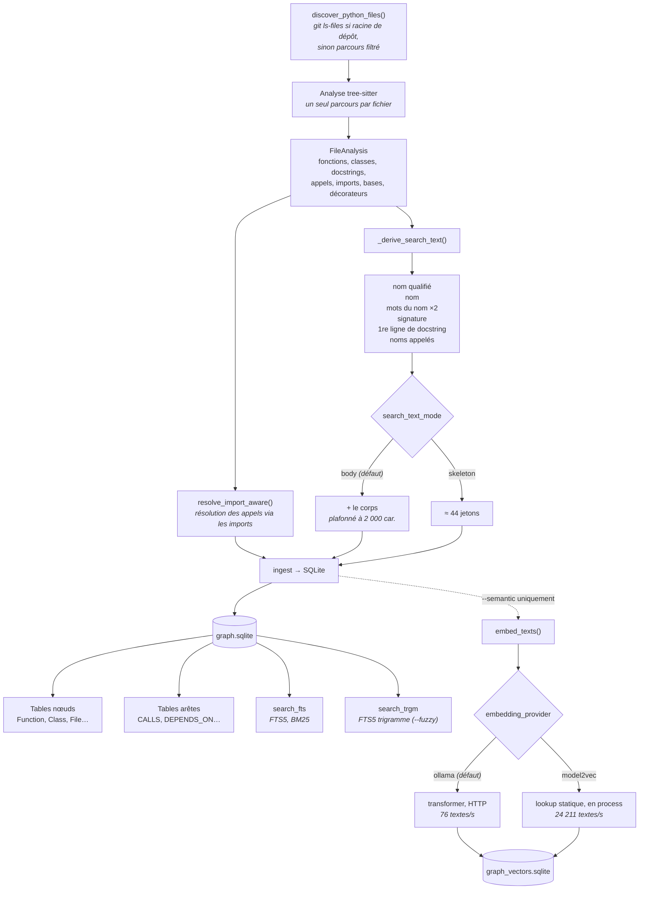
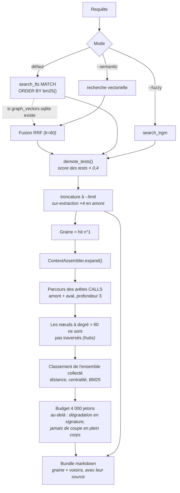

# Architecture : indexation et recherche

Les deux chemins que traverse une requête. Les valeurs par défaut citées sont
celles du code (`settings.py`, `context.py`), pas des approximations.

## 1. Indexation

Un seul passage de tree-sitter par fichier. Rien n'est reparsé ensuite.

**Coût mesuré sur django** (43 663 symboles, 3 585 fichiers) :

| étape | temps | taille |
|---|---|---|
| parse + résolution + SQLite + FTS5 | **0,29 min** | 246 Mo |
| + vecteurs, `ollama/nomic-embed-text` | 8,43 min | +418 Mo |
| + vecteurs, `model2vec/potion-32m` | 0,62 min | — |

L'indexation sans vecteurs est **plus rapide que la construction complète de
zvec-grep** (0,40 min). Les 8 minutes ne sont pas de la lenteur de pipeline :
c'est une passe avant de transformer par symbole.

## 2. Recherche

Deux étapes : trouver la graine, puis étendre le graphe autour d'elle.

Le point important pour l'évaluation : **un appel rend les deux** — le tableau
de hits classés *et* le bundle assemblé. Les mesurer séparément ne décrit ce que
reçoit personne (voir `docs/explanation/benchmarking.md`, run `delivered`).

## 3. Ce que chaque étage coûte et rapporte

Mesuré sur django, 150 requêtes minées depuis l'historique git :

| configuration | R@10 | requête | build |
|---|---|---|---|
| skeleton, BM25 | 0.518 | 461 ms | 0,26 min |
| **body, BM25** | 0.586 | **471 ms** | **0,29 min** |
| body, hybride *(défaut)* | **0.631** | 727 ms | 8,43 min |
| body, hybride statique | 0.578 | 1 191 ms | 0,62 min |
| *zvec-grep, pour référence* | *0.629* | *1 165 ms* | *0,40 min* |

La ligne BM25 seule n'est pas significativement battue par zvec-grep sur R@1,
R@10 ni MRR — uniquement sur R@5, dont 83 % de l'écart tient à `demote_tests`.

`hybrid = not fuzzy and not semantic and vector_db_path.exists()` : la bascule
en hybride est un **effet de bord** de l'existence de l'index vectoriel, pas un
choix explicite. Un `--semantic` lancé une fois engage ensuite 8 minutes à
chaque réindexation et +256 ms par requête.
