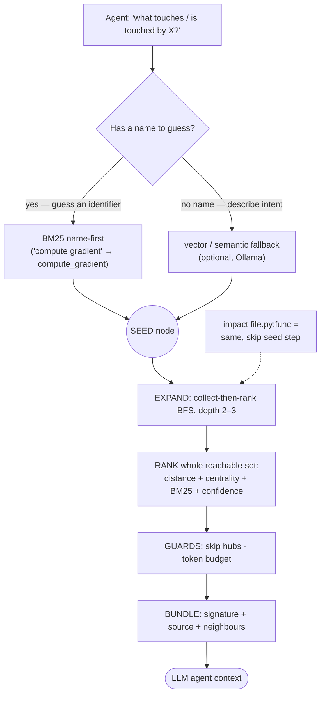
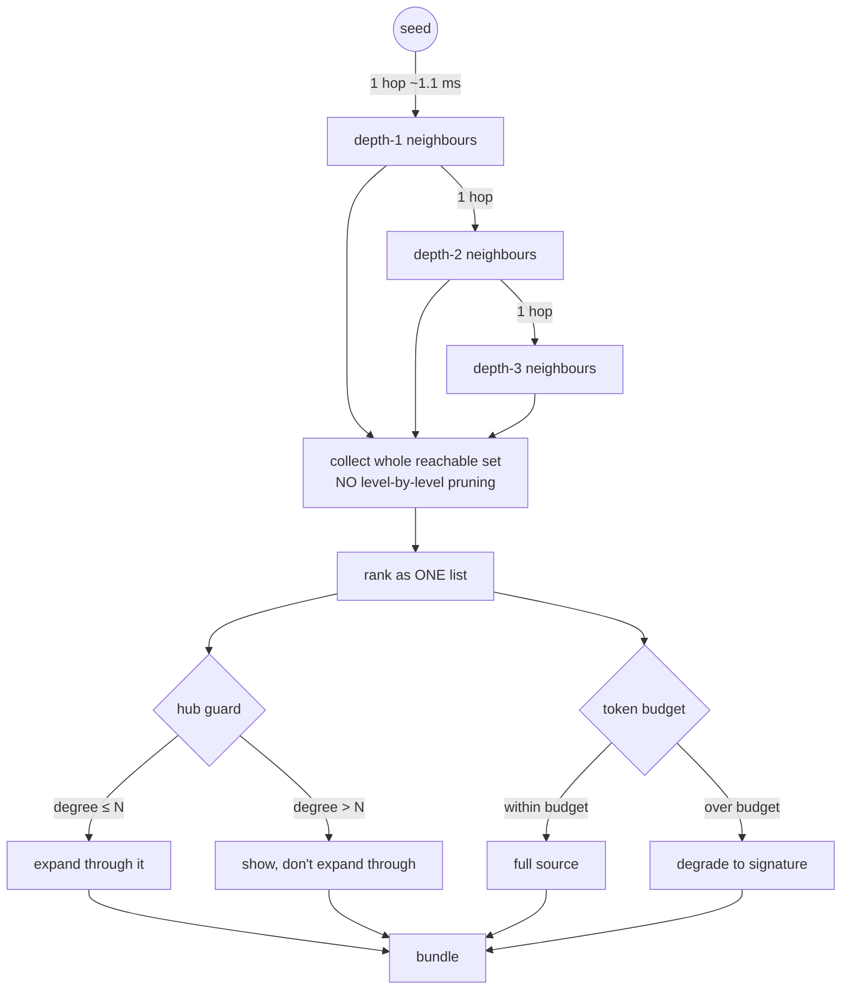

# Competitive strategy: search parity + the influence graph

Status: **implemented for the SQLite backend** (see "What was done" below).

## The conclusion in one line

**"zvec finds *where*; code-explorer finds *what breaks and what's connected*."**

`zvec-grep` (`zg`) is a strong local-first *search platform*: hybrid BM25+vector
retrieval, structure/symbol indexing, a shared MCP server, one-command agent
installs, incremental updates, and built-in local embedding models. It has **no
dependency graph** — no "what influences this / what it influences". That graph
is code-explorer's moat, and it must be correct on the default backend.

## The benchmark (same root: `gemseo/gemseo` library, 1,556 `.py` files)

| Metric | code-explorer (SQLite) | zvec-grep (`zg` 0.2.0) |
|---|---|---|
| Cold index build | ~5 s / ~570 MB RSS | 6.4 s / 1.16 GB RSS |
| Index size | 50 MB | 71 MB (`.py`-only) / 131 MB (full workspace) |
| Entities / nodes | ~9,900 nodes | 8,933 entities |
| One-shot query | 0.37 s (1 ms BM25 + Python import) | 0.77 s hybrid / ~0.1 s FTS-only |
| `"compute gradient"` → real `compute_gradient` | **#2** ✓ | absent from top-5 (hybrid, FTS *and* vector) |
| Semantic/conceptual search | optional (external Ollama) | built-in local model ✓ |
| **Influence / dependency graph** | **yes** | **none** |
| Agent delivery | CLI | MCP server + `zg install` |

Two asymmetries fall out of this:

1. **We win exact-name retrieval** — the primary agent case ("the LLM guesses
   a name"). zvec's always-hybrid default dilutes exact-identifier matches.
2. **They win semantic breadth + agent plumbing**, and we should not race them
   on either.

## The strategy

Two-step funnel, measured against one question — *does it change what the
agent receives?*

**Collect-then-rank, not beam search** — pruning level-by-level is myopic: a
dull depth-1 neighbour may be the only path to the most relevant depth-2 node.
Edges are cheap (~1.1 ms/hop); source is expensive — so traverse wide, rank the
whole set, read source only for the winners.

## Why the edges must be accurate

Depth 2–3 only works on an accurate graph. Measured fan-out (40 seeds, gemseo):

| Graph feeding the BFS | depth-3 reachable set (median / p90 / max) |
|---|---|
| naive name-only resolver (246,630 CALLS) | 14 / 1,187 / 1,664 — unusable |
| import-aware resolver (10,367 CALLS) | **1 / 9 / 19** — hub guard never fires |

## What was done

1. **Merged the DEPENDS_ON branch** — influence edges (inheritance /
   decoration / imports) now land on every backend as one `DEPENDS_ON`
   relation + `kind` (7,219 edges on gemseo).
2. **Ported import-aware resolution to SQLite** — new
   `src/code_explorer/graph/import_resolver.py` reuses the LatticeDB streaming
   path's `ProjectScope` / `_classify_call` / `_resolution` rules in-memory,
   replacing the naive by-name `CallResolver`. CALLS edges collapse
   246,630 → 10,367 (3,840 to Class constructors).
3. **Made SQLite the default backend** for `search` and `impact`
   (`--backend [lattice|sqlite]`, default `sqlite`). SQLite is the only backend
   where multi-word BM25 is correct (LatticeDB FTS defect), and it is now also
   the backend with the accurate graph.

## Still open (priority order)

1. **External-symbol boundary edges** — the resolver classifies 4,471 external
   calls but doesn't materialize `CALLS_EXTERNAL` edges / `ExternalSymbol`
   nodes on SQLite yet.
2. **Confidence on CALLS edges** — `resolution_method` / `confidence` are
   computed but only `call_line` is stored; surface them in the bundle.
3. **MCP server** — expose `search` → `impact` → `expand` as a tool so agents
   can call it alongside zvec (which already ships one).
4. **File the two LatticeDB 0.15.0 bugs upstream** (unclean-shutdown lock;
   multi-term FTS returns `[]`).
5. **Push** — `streaming-integration` is ahead of `origin` and `main`.

See also `docs/explanation/latticedb-migration.md` and
`docs/explanation/source-of-truth-and-search-representations.md` for the
storage/query design this builds on.
