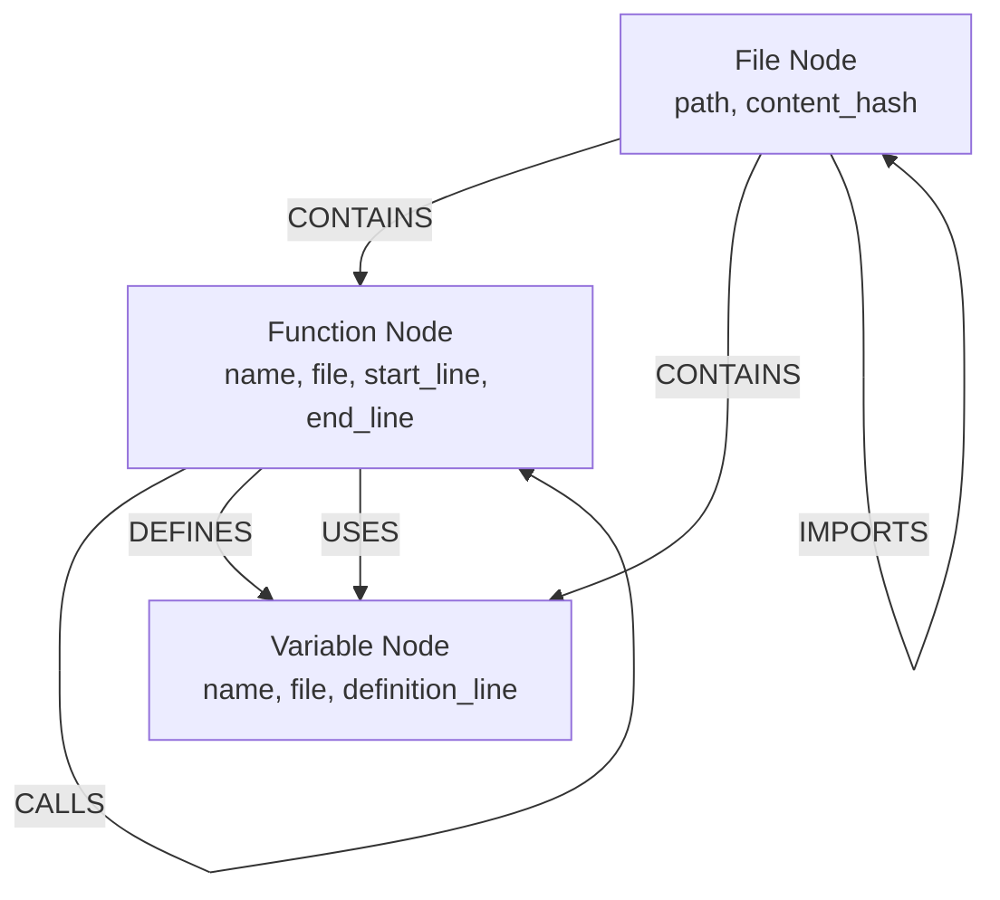
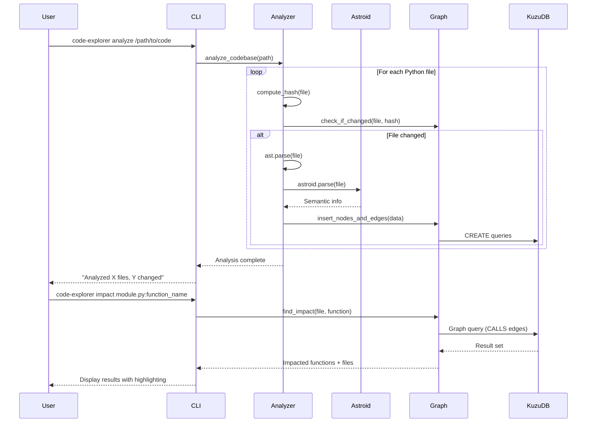

# Design: Dependency Analysis

## Context
Code Explorer needs to provide fast, fine-grained impact analysis for Python codebases. The key challenge is balancing speed (analyzing large codebases quickly) with precision (tracking dependencies at the line level, not just module level).

Existing tools either focus on module-level dependencies (fast but imprecise) or require expensive AST traversal for every query (slow but precise). We need an approach that combines the speed of cached analysis with the query efficiency of a graph database.

**Key Stakeholders**: Developers who need to understand code impact before making changes, especially in large, unfamiliar codebases.

**Constraints**:
- Must support Python 3.13+
- Must handle codebases with 1000+ files
- Query response time must be sub-second
- Must track line-level dependencies, not just module-level
- Must use only well-maintained, actively developed tools

## Goals / Non-Goals

### Goals
- Fast initial analysis (seconds to minutes for large codebases)
- Sub-second query response time for impact analysis
- Line-level precision for dependency tracking
- Incremental updates (only re-analyze changed files)
- Support for both data dependencies (variable usage) and control dependencies (function calls)
- Visual representation of dependency graphs
- Answer key questions:
  - "How does changing this function affect upstream/downstream code?"
  - "Where can this bug come from or go to?"

### Non-Goals
- Real-time analysis (we analyze on-demand, not continuously)
- Support for languages other than Python (future work)
- Dynamic dependency tracking (runtime behavior analysis)
- Automated refactoring or code transformation
- IDE integration (future work)

## Decisions

### Decision 1: Simple Architecture (ast + astroid + KuzuDB)
**What**: Use Python's built-in `ast` module for basic parsing, `astroid` for semantic analysis, and KuzuDB for storing and querying dependencies.

**Why**:
- `ast` is always available, always maintained (Python stdlib)
- `astroid` is battle-tested (powers Pylint), actively maintained, provides semantic analysis and name resolution
- KuzuDB is a high-performance property graph database designed for efficient graph queries
- All three are actively maintained and well-documented
- Simple stack = easier to maintain and debug

**Alternatives considered**:
- **Pyrefly**: Too new (released 2025), focused on type checking not dependency analysis, overkill for MVP
- **PyCG**: Archived (no future updates), despite good precision (99.2%)
- **JARVIS**: Research tool, hard to install, limited documentation
- **Scalpel**: Unclear maintenance status, only 100 GitHub stars, last major update 2022
- **Pure ast module**: No semantic analysis, can't resolve names across files
- **Pure astroid**: Slower than caching in graph database

### Decision 2: Simplified Graph Schema
**What**: Use only essential node types: File, Function, Variable. Use essential edges: CONTAINS, CALLS, DEFINES, USES.

**Why**:
- Simpler schema = faster to implement and easier to query
- Covers the core use cases (function impact, data flow)
- Can add more node types (Class, Statement) later if needed
- Focus on MVP: get it working, then enhance

**Trade-offs**: Less granular than original plan (no Statement nodes initially), but sufficient for answering key questions.

### Decision 3: Content Hashing for Incremental Updates
**What**: Store SHA-256 hash of file contents in File nodes and only re-analyze changed files.

**Why**:
- Dramatically speeds up subsequent analyses (only changed files need re-parsing)
- Simple to implement and reliable
- Low overhead (hashing is fast)

**Alternatives considered**:
- Git-based change detection: More complex, requires git repository
- Timestamp-based: Unreliable (file can be touched without changes)

### Decision 4: Parallel Analysis with ThreadPoolExecutor
**What**: Use Python's concurrent.futures.ThreadPoolExecutor to analyze multiple files in parallel.

**Why**:
- I/O-bound workload (reading files) benefits from threading
- Simple API, built-in to Python standard library
- Good balance of complexity and performance

**Alternatives considered**:
- ProcessPoolExecutor: Overhead of inter-process communication not worth it for our workload
- asyncio: More complex, not significantly faster for file I/O

### Decision 5: CLI-First Interface
**What**: Start with a command-line interface using Click.

**Why**:
- Simplest to implement and test
- Integrates well with developer workflows
- Can be extended to API/library later

**Future work**: Python API for programmatic usage, IDE plugins.

### Decision 6: Mermaid for Visualization
**What**: Generate Mermaid diagrams for dependency graphs.

**Why**:
- Text-based format (easy to generate)
- Widely supported (GitHub, VS Code, etc.)
- Good balance of simplicity and readability
- Can highlight impacted nodes with different colors

**Alternatives considered**:
- Graphviz: More powerful but requires external tool
- D3.js: Interactive but requires web interface

## Graph Schema (Simplified)



### Node Properties

**File**
- path (string, primary key)
- language (string, always "python")
- last_modified (timestamp)
- content_hash (string, SHA-256)

**Function**
- name (string)
- file (string, reference to File.path)
- start_line (integer)
- end_line (integer)
- is_public (boolean, not starting with _)

**Variable**
- name (string)
- file (string)
- definition_line (integer)
- scope (string, e.g., "module", "function:func_name")

### Edge Properties

**CONTAINS**: From File to Function/Variable
- No additional properties

**CALLS**: From Function to Function
- call_line (integer, where the call occurs)

**DEFINES**: From Function to Variable
- No additional properties (variables defined in function scope)

**USES**: From Function to Variable
- usage_line (integer, where variable is used)

**IMPORTS**: From File to File
- is_direct (boolean)
- line_number (integer)

## Analysis Workflow



## Key Queries

### Query 1: "How does changing function X affect code?"

```cypher
// Find the function
MATCH (f:Function {name: 'process_data', file: 'module.py'})

// UPSTREAM: Who calls it? (will break if we change signature)
MATCH (caller:Function)-[:CALLS]->(f)
RETURN caller.name, caller.file, caller.start_line

// DOWNSTREAM: What does it call? (we'll break if they change)
MATCH (f)-[:CALLS]->(callee:Function)
RETURN callee.name, callee.file, callee.start_line
```

### Query 2: "Where can bug in variable come from/go to?"

```cypher
// Find variable definition
MATCH (v:Variable {name: 'user_input', file: 'module.py', definition_line: 42})

// Where does it come from?
MATCH (definer:Function)-[:DEFINES]->(v)
RETURN definer.name, definer.file

// Where does it go? (where is it used)
MATCH (user:Function)-[:USES]->(v)
RETURN user.name, user.file, user.start_line
```

### Query 3: "Transitive impact analysis"

```cypher
// Find all functions affected within 3 hops
MATCH (f:Function {name: 'process_data', file: 'module.py'})
MATCH (caller:Function)-[:CALLS*1..3]->(f)
RETURN DISTINCT caller.name, caller.file
```

## Risks / Trade-offs

### Risk: Semantic analysis accuracy with astroid
- **Risk**: astroid may not resolve all names correctly, especially with complex imports
- **Mitigation**:
  - Fall back to simple name matching when resolution fails
  - Document known limitations
  - Mark uncertain edges with confidence score (future enhancement)
- **Trade-off**: Some false positives/negatives vs perfect accuracy

### Risk: KuzuDB performance with very large graphs
- **Risk**: Graph with millions of nodes may become slow
- **Mitigation**:
  - Use depth-limited queries (max 5 hops default)
  - Add query timeouts
  - Consider partitioning by module for very large codebases
- **Trade-off**: May miss some transitive dependencies beyond depth limit

### Risk: False positives in dependency detection
- **Risk**: Static analysis may report dependencies that don't exist at runtime
- **Mitigation**:
  - Focus on conservative analysis (include possible dependencies)
  - Document limitations in user guide
  - Future: Add confidence scores
- **Trade-off**: Better to have false positives than false negatives for impact analysis

### Risk: Memory usage during parallel analysis
- **Risk**: Analyzing many files in parallel may consume excessive memory
- **Mitigation**:
  - Limit ThreadPoolExecutor to reasonable number of workers (e.g., 4-8)
  - Process files in batches
- **Trade-off**: Slightly slower analysis but more stable

## Migration Plan

This is a new feature with no existing implementation, so no migration is needed. However, we should consider:

1. **Database location**: Store KuzuDB database in project-local `.code-explorer/` directory by default
2. **Versioning**: Include schema version in database metadata for future schema changes
3. **Backward compatibility**: Plan for schema evolution from the start

## Open Questions

1. **Should we support configuration files** (e.g., `.code-explorer.toml`) for excluding certain files or directories?
   - Proposal: Yes, add in a follow-up change after core feature is stable

2. **How should we handle dynamic imports** (e.g., `importlib.import_module(variable)`)?
   - Proposal: Document as limitation; requires runtime analysis

3. **Should we track Class nodes separately** from functions?
   - Proposal: Start without them in MVP, add in follow-up if needed

4. **What's the optimal depth limit** for transitive queries?
   - Proposal: Default to 5 hops, make configurable

5. **Should we provide an API** in addition to CLI?
   - Proposal: Yes, but in a separate change after CLI is stable
